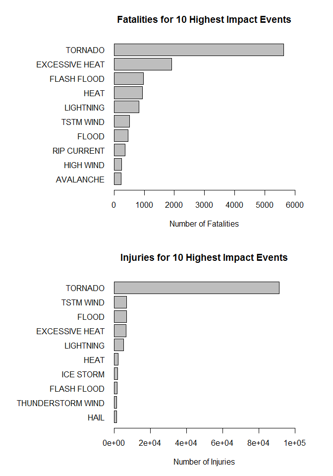
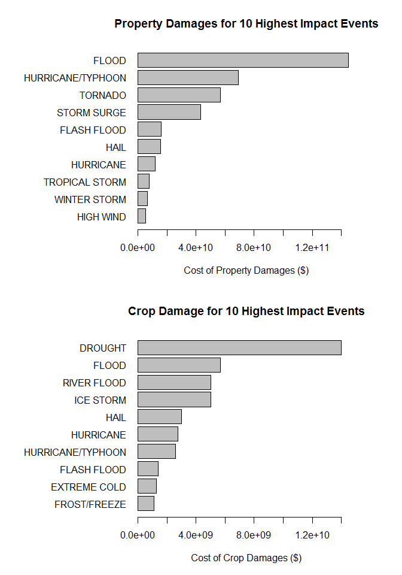

# Analysis of the Impact of Severe Weather Events
Y. Zheng  
Saturday, October 8th, 2016  

## Synopsis
Storms and other severe weather events can cause both public health and economic problems for communities and municipalities. Many severe events can result in fatalities, injuries, and property damage, and preventing such outcomes to the extent possible is a key concern.

This project involves exploring the U.S. National Oceanic and Atmospheric Administration's (NOAA) storm database. This database tracks characteristics of major storms and weather events in the United States, including when and where they occur, as well as estimates of any fatalities, injuries, and property damage.

The following analysis answers the following questions:

1. Across the United States, which types of events (as indicated in the EVTYPE variable) are most harmful with respect to population health?
2. Across the United States, which types of events have the greatest economic consequences?

## Data Processing
The data for this assignment come in the form of a comma-separated-value file compressed via the bzip2 algorithm to reduce its size.

* [Storm Data](https://d396qusza40orc.cloudfront.net/repdata%2Fdata%2FStormData.csv.bz2) [47Mb]

Documentations for the database is available from the following links:

* National Weather Service [Storm Data Documentation](https://d396qusza40orc.cloudfront.net/repdata%2Fpeer2_doc%2Fpd01016005curr.pdf)  
* National Climatic Data Center Storm Events [FAQ](https://d396qusza40orc.cloudfront.net/repdata%2Fpeer2_doc%2FNCDC%20Storm%20Events-FAQ%20Page.pdf)

The events in the database start in the year 1950 and end in November 2011. In the earlier years of the database there are generally fewer events recorded, most likely due to a lack of good records. More recent years should be considered more complete.  


```r
# Loading useful libraries
library(dplyr, warn.conflicts = FALSE)

# Download Data
download.file("https://d396qusza40orc.cloudfront.net/repdata%2Fdata%2FStormData.csv.bz2", 
              destfile='StormData.csv.bz2')

# Extract Data
stormData <- read.csv(bzfile('StormData.csv.bz2'), stringsAsFactors = FALSE)
```

We inspect the dimensions of the dataset and the first few columns of the dataset.

```r
dim(stormData)
```

```
## [1] 902297     37
```

```r
head(stormData)
```

```
##   STATE__           BGN_DATE BGN_TIME TIME_ZONE COUNTY COUNTYNAME STATE
## 1       1  4/18/1950 0:00:00     0130       CST     97     MOBILE    AL
## 2       1  4/18/1950 0:00:00     0145       CST      3    BALDWIN    AL
## 3       1  2/20/1951 0:00:00     1600       CST     57    FAYETTE    AL
## 4       1   6/8/1951 0:00:00     0900       CST     89    MADISON    AL
## 5       1 11/15/1951 0:00:00     1500       CST     43    CULLMAN    AL
## 6       1 11/15/1951 0:00:00     2000       CST     77 LAUDERDALE    AL
##    EVTYPE BGN_RANGE BGN_AZI BGN_LOCATI END_DATE END_TIME COUNTY_END
## 1 TORNADO         0                                               0
## 2 TORNADO         0                                               0
## 3 TORNADO         0                                               0
## 4 TORNADO         0                                               0
## 5 TORNADO         0                                               0
## 6 TORNADO         0                                               0
##   COUNTYENDN END_RANGE END_AZI END_LOCATI LENGTH WIDTH F MAG FATALITIES
## 1         NA         0                      14.0   100 3   0          0
## 2         NA         0                       2.0   150 2   0          0
## 3         NA         0                       0.1   123 2   0          0
## 4         NA         0                       0.0   100 2   0          0
## 5         NA         0                       0.0   150 2   0          0
## 6         NA         0                       1.5   177 2   0          0
##   INJURIES PROPDMG PROPDMGEXP CROPDMG CROPDMGEXP WFO STATEOFFIC ZONENAMES
## 1       15    25.0          K       0                                    
## 2        0     2.5          K       0                                    
## 3        2    25.0          K       0                                    
## 4        2     2.5          K       0                                    
## 5        2     2.5          K       0                                    
## 6        6     2.5          K       0                                    
##   LATITUDE LONGITUDE LATITUDE_E LONGITUDE_ REMARKS REFNUM
## 1     3040      8812       3051       8806              1
## 2     3042      8755          0          0              2
## 3     3340      8742          0          0              3
## 4     3458      8626          0          0              4
## 5     3412      8642          0          0              5
## 6     3450      8748          0          0              6
```

## Results
This project adopts the following key definitions for analysis:

* **Harm w.r.t. Population Heath** is a *strictly monotonically decreasing* function of (*Fatalities*, *Injuries*)
* **Economic Consequences** is a *strictly monotonically increasing* function of (*|Property Damage|*, *|Crop Damage|*)

Since we are concerned only with damages, the modulus may be dropped during analysis.

### Data Analysis
We seek to find the highest contributors of each Fatalities, Injuries, Property Damage and Crop Damage.  
Allows us to evaluate which Storm Event has the greatest impact on **Population Health** and **Economic Consequences**.  


```r
# Inspection of unique property damage/crop damage units reveals undocumented units. 
# They are ignored and assumed to be $1.
propertyDMG <- with(stormData, mapply(function(x, y){
    if (y == "K" | y == "k") 1000*x
    else if (y == "M" || y == "m") 1e6*x
    else if (y == "B" || y == "b") 1e9*x
    else x
}, PROPDMG, PROPDMGEXP))

cropDMG <- with(stormData, mapply(function(x, y){
    if (y == "K" | y == "k") 1000*x
    else if (y == "M" || y == "m") 1e6*x
    else if (y == "B" || y == "b") 1e9*x
    else x
}, CROPDMG, CROPDMGEXP))

# Collate Data
reqData <- with(stormData, data.frame(eventType = EVTYPE, 
                                      Fatalities = FATALITIES, Injuries = INJURIES,
                                      propertyDMG = propertyDMG, cropDMG = cropDMG))

# Group and Summarize data by Event Type
reqData <- reqData %>% group_by(eventType) %>% 
    summarize(Fatalities = sum(Fatalities), Injuries = sum(Injuries),
              propertyDMG = sum(propertyDMG), cropDMG = sum(cropDMG))
```

### Impact of Weather Events on **Popluation Health**
There are nearly 1000 different events, we are only concerned with comparing events that are significant.  
Conservative approximations determines top 10 events to be a decent significant representation for fatalities and injuries respectively.


```r
# Set up for 2 horizontal row-wise barplots
# Allocates space for labels
par(mfrow = c(2, 1), mar = c(5, 12, 4, 4))

# Orders the fatalities and plots
fatalities <- reqData[order(-reqData$Fatalities), ]

with(fatalities[10:1, ], 
     barplot(Fatalities, main="Fatalities for 10 Highest Impact Events", horiz=TRUE, 
             names.arg=eventType, las=1,
             xlab = "Number of Fatalities", xlim=c(0, 6000)))

# Orders the injuries and plots
injuries <- reqData[order(-reqData$Injuries), ]

with(injuries[10:1, ], 
     barplot(Injuries, main="Injuries for 10 Highest Impact Events", horiz=TRUE, 
             names.arg=eventType, las=1,
             xlab = "Number of Injuries", xlim=c(0, 100000)))
```

<!-- -->

According to our definitions above, we can conclude with conviction that **Tornados** have the **most harmful inpact on population health**.


### Impact of Weather Events on **Economic Consequences**
There are nearly 1000 different events, we are only concerned with comparing events that are significant.  
Conservative approximations determines top 10 events to be a decent significant representation for properties and crop damages respectively.


```r
# Set up for 2 horizontal row-wise barplots
# Allocates space for labels
par(mfrow = c(2, 1), mar = c(5, 12, 4, 4))

# Orders the property damages and plots
propdamage <- reqData[order(-reqData$propertyDMG), ]

with(propdamage[10:1, ], 
     barplot(propertyDMG, main="Property Damages for 10 Highest Impact Events", horiz=TRUE, 
             names.arg=eventType, las=1,
             xlab = "Cost of Property Damages ($)", xlim = c(0, 1.5e11)))

# Orders the crop damages and plots
cropdamage <- reqData[order(-reqData$cropDMG), ]

with(cropdamage[10:1, ], 
     barplot(cropDMG, main="Crop Damage for 10 Highest Impact Events", horiz=TRUE, 
             names.arg=eventType, las=1,
             xlab = "Cost of Crop Damages ($)", xlim = c(0, 1.5e10)))
```

<!-- -->

We may conclude that **Floods** and **Droughts** are the most impactful in terms of **Economic Consequences**.

#### Session Details
Specification of software and hardware used.

```r
sessionInfo()
```

```
## R version 3.3.1 (2016-06-21)
## Platform: x86_64-w64-mingw32/x64 (64-bit)
## Running under: Windows 10 x64 (build 14393)
## 
## locale:
## [1] LC_COLLATE=English_Singapore.1252  LC_CTYPE=English_Singapore.1252   
## [3] LC_MONETARY=English_Singapore.1252 LC_NUMERIC=C                      
## [5] LC_TIME=English_Singapore.1252    
## 
## attached base packages:
## [1] stats     graphics  grDevices utils     datasets  methods   base     
## 
## loaded via a namespace (and not attached):
##  [1] magrittr_1.5    formatR_1.4     tools_3.3.1     htmltools_0.3.5
##  [5] yaml_2.1.13     Rcpp_0.12.7     stringi_1.1.1   rmarkdown_1.0  
##  [9] knitr_1.14      stringr_1.1.0   digest_0.6.10   evaluate_0.9
```

